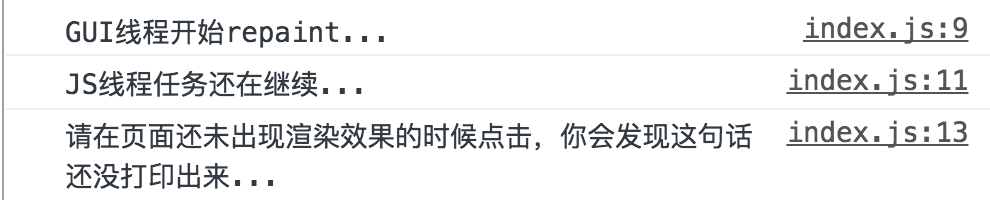

# 浏览器线程机制理解

## 参考文章
[JS运行机制](https://juejin.im/post/5a6547d0f265da3e283a1df7)


## 各个线程

1. GUI渲染线程

    * 负责渲染浏览器界面，解析HTML，CSS，构建DOM树和RenderObject树，布局和绘制等。
    * 当界面需要重绘（Repaint）或由于某种操作引发回流(reflow)时，该线程就会执行
    * 注意，**GUI渲染线程与JS引擎线程是互斥的**，当JS引擎执行时GUI线程会被挂起（相当于被冻结了），GUI更新会被保存在一个队列中等到JS引擎空闲时立即被执行。

2. JS引擎线程

    * 也称为JS内核，负责处理Javascript脚本程序。（例如V8引擎）
    * JS引擎线程负责解析Javascript脚本，运行代码。
    * JS引擎一直等待着任务队列中任务的到来，然后加以处理，一个Tab页（renderer进程）中无论什么时候都只有一个JS线程在运行JS程序
    * 同样注意，GUI渲染线程与JS引擎线程是互斥的，所以如果JS执行的时间过长，这样就会造成页面的渲染不连贯，导致页面渲染加载阻塞。

3. 事件触发线程

    * 归属于浏览器而不是JS引擎，用来控制事件循环（可以理解，JS引擎自己都忙不过来，需要浏览器另开线程协助）
    * 当JS引擎执行代码块如setTimeOut时（也可来自浏览器内核的其他线程,如鼠标点击、AJAX异步请求等），会将对应任务添加到事件线程中
    * 当对应的事件符合触发条件被触发时，该线程会把事件添加到待处理队列的队尾，等待JS引擎的处理
    * 注意，由于JS的单线程关系，所以这些待处理队列中的事件都得排队等待JS引擎处理（当JS引擎空闲时才会去执行）

4. 定时触发器线程(选读)

    * 传说中的setInterval与setTimeout所在线程
    * 浏览器定时计数器并不是由JavaScript引擎计数的,（因为JavaScript引擎是单线程的, 如果处于阻塞线程状态就会影响记计时的准确）
    * 因此通过单独线程来计时并触发定时（计时完毕后，添加到事件队列中，等待JS引擎空闲后执行）
    * 注意，W3C在HTML标准中规定，规定要求setTimeout中低于4ms的时间间隔算为4ms。

5. 异步http请求线程(选读)

    * 在XMLHttpRequest在连接后是通过浏览器新开一个线程请求
    * 将检测到状态变更时，如果设置有回调函数，异步线程就产生状态变更事件，将这个回调再放入事件队列中。再由JavaScript引擎执行。


## 浏览器渲染流程（GUI线程）

1. 解析html建立dom树
2. 解析css构建render树（将CSS代码解析成树形的数据结构，然后结合DOM合并成render树）
3. 布局render树（Layout/reflow），负责各元素尺寸、位置的计算
4. 绘制render树（paint），绘制页面像素信息
5. 浏览器会将各层的信息发送给GPU，GPU会将各层合成（composite），显示在屏幕上。


### css加载是否会阻塞dom树渲染？
这里说的是头部引入css的情况,首先，我们都知道：css是由单独的下载线程异步下载的。然后再说下几个现象：

1. css加载不会阻塞DOM树解析（异步加载时DOM照常构建）
2. **但会阻塞render树渲染（渲染时需等css加载完毕，因为render树需要css信息）**

可以新建一个html文件，在头部放入 `<link rel="stylesheet" href="http://www.google.com/index.css">`
可以发现，页面被阻塞了（前提是你的网不会翻墙）。

## 从Event Loop谈JS的运行机制（js线程）

先理解一个概念：

1. JS分为同步任务和异步任务
2. 同步任务都在主线程上执行，形成一个`执行栈`
3. 主线程之外，事件触发线程管理着一个`任务队列`，只要异步任务有了运行结果，就在`任务队列`之中放置一个事件。
4. 一旦执行栈中的所有同步任务执行完毕（此时JS引擎空闲），系统就会读取`任务队列`，将可运行的异步任务添加到可执行栈中，开始执行。

如图：


看到这里，应该就可以理解了：为什么有时候setTimeout推入的事件不能准时执行？因为可能在它推入到事件列表时，主线程还不空闲，正在执行其它代码， 所以自然有误差。

这里就直接引用一张图片来协助理解:


上图大致描述就是：

* 主线程运行时会产生执行栈，
* 栈中的代码调用某些api时，它们会在事件队列中添加各种事件（当满足触发条件后，如ajax请求完毕）
* 而栈中的代码执行完毕，就会读取事件队列中的事件，去执行那些回调
* 如此循环
* 注意，总是要等待栈中的代码执行完毕后才会去读取事件队列中的事件

### 单独说说定时器

上述事件循环机制的核心是：JS引擎线程和事件触发线程
但事件上，里面还有一些隐藏细节，譬如调用setTimeout后，是如何等待特定时间后才添加到事件队列中的？
是JS引擎检测的么？当然不是了。它是由定时器线程控制（因为JS引擎自己都忙不过来，根本无暇分身）
为什么要单独的定时器线程？因为JavaScript引擎是单线程的, 如果处于阻塞线程状态就会影响记计时的准确，因此很有必要单独开一个线程用来计时

### macrotask与microtask

1. macrotask（又称之为宏任务），可以理解是每次执行栈执行的代码就是一个宏任务（包括每次从事件队列中获取一个事件回调并放到执行栈中执行）

    * 每一个task会从头到尾将这个任务执行完毕，不会执行其它
    * 浏览器为了能够使得JS内部task与DOM任务能够有序的执行，会在一个task执行结束后，在下一个 task 执行开始前，对页面进行重新渲染（task->渲染->task->...）

2. microtask（又称为微任务），可以理解是在当前 task 执行结束后立即执行的任务

    * 也就是说，在当前task任务后，下一个task之前，在渲染之前
    * 所以它的响应速度相比setTimeout（setTimeout是task）会更快，因为无需等渲染
    * 也就是说，在某一个macrotask执行完后，就会将在它执行期间产生的所有microtask都执行完毕（在渲染前）

分别很么样的场景会形成macrotask和microtask呢？

macrotask：

* 主代码块
* setTimeout、setInterval
* dom事件
* requestAnimationFrame（拥有`事件触发线程`的事件池**暂时发现的**最高优先级）、requestIdleCallback（拥有`事件触发线程`的事件池**暂时发现的**最低优先级）
* ajax请求

microtask：
* Promise.then()
* process.nextTick

可以看到，事件队列中的每一个事件都是一个macrotask。

**补充**：在node环境下，process.nextTick的优先级高于Promise，也就是可以简单理解为：在宏任务结束后会先执行微任务队列中的nextTickQueue部分，然后才会执行微任务中的Promise部分。

再根据线程来理解下：
* macrotask中的事件都是放在一个事件队列中的，而这个队列由事件触发线程维护
* microtask中的所有微任务都是添加到微任务队列（Job Queues）中，等待当前macrotask执行完毕后执行，而这个队列由JS引擎线程维护
（这点由自己理解+推测得出，因为它是在主线程下无缝执行的）

所以，总结下运行机制：
1. 执行一个宏任务（栈中没有就从事件队列中获取）
2. 执行过程中如果遇到微任务，就将它添加到微任务的任务队列中
3. 宏任务执行完毕后，立即执行当前微任务队列中的所有微任务（依次执行）
4. 当前宏任务执行完毕，开始检查渲染，然后GUI线程接管渲染
5. 渲染完毕后，JS线程继续接管，开始下一个宏任务（从事件队列中获取）


## 1. GUI渲染线程与JS引擎线程互斥

由于JavaScript是可操纵DOM的，如果在修改这些元素属性同时渲染界面（即JS线程和UI线程同时运行），那么渲染线程前后获得的元素数据就可能不一致了。
因此为了防止渲染出现不可预期的结果，浏览器设置GUI渲染线程与JS引擎为互斥的关系，当JS引擎执行时GUI线程会被挂起，
GUI更新则会被保存在一个队列中等到JS引擎线程空闲时立即被执行。

看下这个例子：

### JS线程执行任务，阻塞页面加载，GUI线程等待
从上述的互斥关系，可以推导出，JS如果执行时间过长就会阻塞页面。
譬如，假设JS引擎正在进行巨量的计算，此时就算GUI有更新，也会被保存到队列中，等待JS引擎空闲后执行。
然后，由于巨量计算，所以JS引擎很可能很久很久后才能空闲，自然会感觉到巨卡无比。
所以，要尽量避免JS执行时间过长，这样就会造成页面的渲染不连贯，导致页面渲染加载阻塞的感觉。可以考虑将不操作dom的耗时任务放到`Worker`里面处理

### GUI线程渲染页面，js线程任务执行需等待

当GUI线程渲染任务量过大，例如需要渲染大量的dom元素，页面有存在大量dom元素。操作元素位置导致严重破坏原来的layout，需要重新layout。
可以发现，js主线程待执行的任务会延迟执行。可以考虑使用`requestIdleCallback`或`requestAnimationFrame`去优化

### 验证

打开 `[index.js](./GUI_JS/index.js)` 可以发现，在打开页面后，创建100000个div元素，挂到body上。同时注册body的点击事件. 作如下操作：
```
npm start file -- --./js/JsThread/GUI_JS
```
在页面还没渲染出元素的时候，点击页面。在控制台可以看到如下结果：



可以发现：
1. 当JS引擎执行时GUI线程会被挂起：在 `GUI线程开始repaint...`的时候，`JS线程任务还在继续...`紧接着打印出来
2. GUI线程执行的时候。JS引擎会推迟执行：100000个div元素还没渲染出来的时候点击onClick，事件被推入JS引擎任务队列，却没有立即打印，而是div渲染出来之后，才打印出来。


## 3. 各个异步函数的执行优先级

[参考文章](http://www.ruanyifeng.com/blog/2015/09/web-page-performance-in-depth.html)

1. `requestAnimationFrame`: **异步函数，不是微任务**，方法告诉浏览器您希望执行动画并请求浏览器在下一次重绘之前调用指定的函数来更新动画。该方法使用一个回调函数作为参数，这个回调函数会在浏览器重绘之前调用。
2. `requestIdleCallback`: **异步函数，不是微任务**, 会在浏览器空闲时期依次调用函数， 这就可以让开发者在主事件循环中执行后台或低优先级的任务，而且不会对像动画和用户交互这样延迟触发而且关键的事件产生影响。函数一般会按先进先调用的顺序执行，除非函数在浏览器调用它之前就到了它的超时时间。
`requestAnimationFrame` 拥有一帧时间内的高优先级，`requestIdleCallback` 拥有一帧时间内的最低优先级
### 验证

打开[文件夹](./Priority)，运行：

```
npm start file -- --./js/JsThread/Priority
```
建议直接拷贝`index.js`代码在浏览器运行，结果直观点，结果如下：


## 最后总结

画个图吧：
